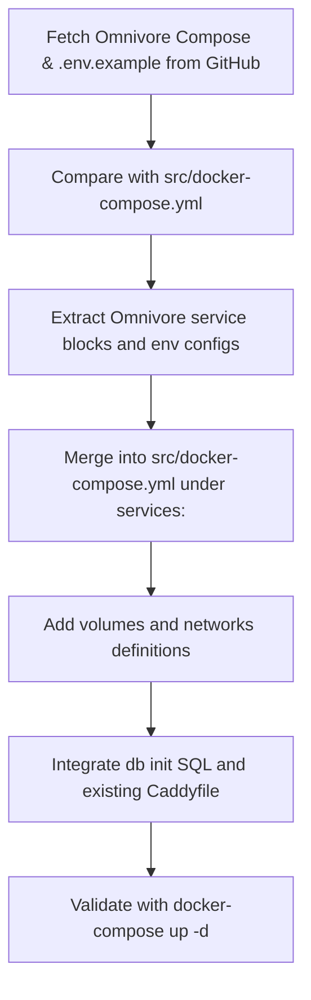

# Docker Compose Integration Plan



## Integration Steps

1. Download from GitHub:
   - `docker-compose.yml`  
     https://raw.githubusercontent.com/omnivore-app/omnivore/main/self-hosting/docker-compose/docker-compose.yml  
   - `.env.example`  
     https://raw.githubusercontent.com/omnivore-app/omnivore/main/self-hosting/docker-compose/.env.example  

2. Read and analyze existing `src/docker-compose.yml`.

3. Extract Omnivore services (using new block structure v3):
   - postgres (with pgvector image, volumes, `env_file: .env`)
   - migrate
   - api
   - queue-processor
   - web
   - image-proxy
   - content-fetch
   - redis
   - minio
   - createbuckets (bucket creation script)
   - mail-watch-server

4. Insert each service under the top-level `services:` section in `src/docker-compose.yml`, adjusting:
   - Indentation to match version 3.8
   - `env_file: .env` → map to compose `environment:` or project `.env`
   - Ports and healthchecks
   - `depends_on` conditions

5. Merge volume definitions:
   ```yaml
   volumes:
     pgdata:
     redis_data:
     minio_data:
   ```
   alongside existing volumes (`n8n_data`, `postgres_data`, etc.).

6. Ensure the project `.env` (or `docker-compose` environment) includes keys from `.env.example`:
   - Database credentials for Omnivore (`PG_HOST`, `PG_USER`, `PG_PASSWORD`, etc.)
   - API secrets (`JWT_SECRET`, `SSO_JWT_SECRET`, etc.)
   - Service URLs (`CLIENT_URL`, `IMAGE_PROXY_URL`, etc.)
   - Redis, Minio, Mail watcher keys

7. Confirm `src/db/init-omnivore.sql` mount for Omnivore DB initialization is preserved.

8. Update `src/Caddyfile` (if needed) to route:
   - `${OMNIVORE_HOST}` → `omnivore-web:8080`
   - Proxy `/api` → `omnivore-api:8080`
   - Other paths as required.

9. Validate locally:
   ```bash
   docker-compose -f src/docker-compose.yml up -d
   docker-compose -f src/docker-compose.yml logs -f
   ```
   - Verify n8n, Omnivore API, Web, and dependencies start healthy.
   - Test web at `https://${OMNIVORE_HOST}` and API endpoints.

10. Tweak environment or service settings (ports, timeouts, healthchecks) and repeat tests until stable.